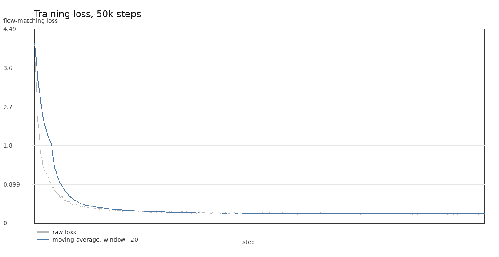
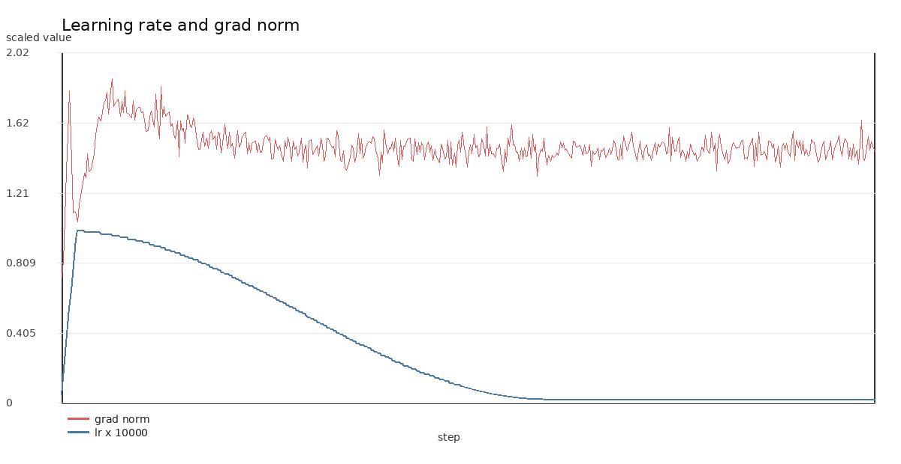
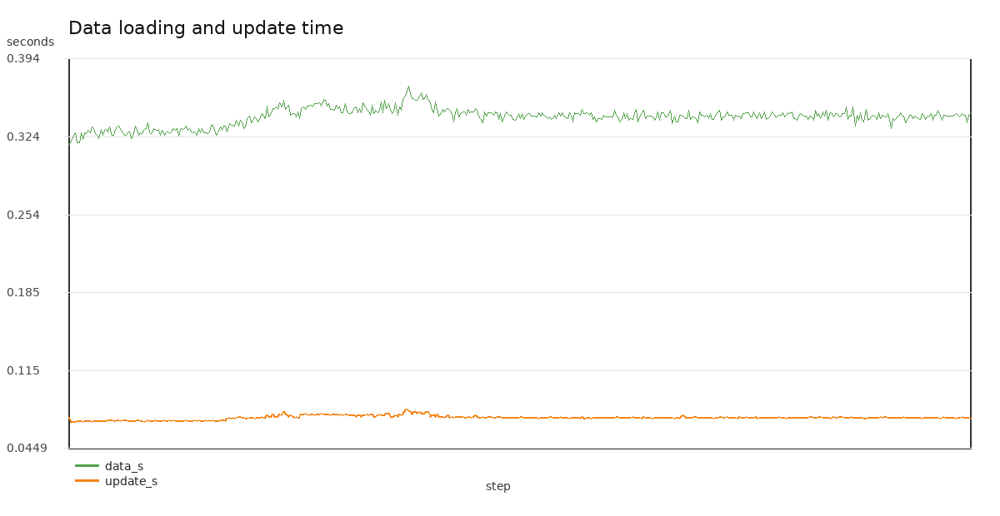
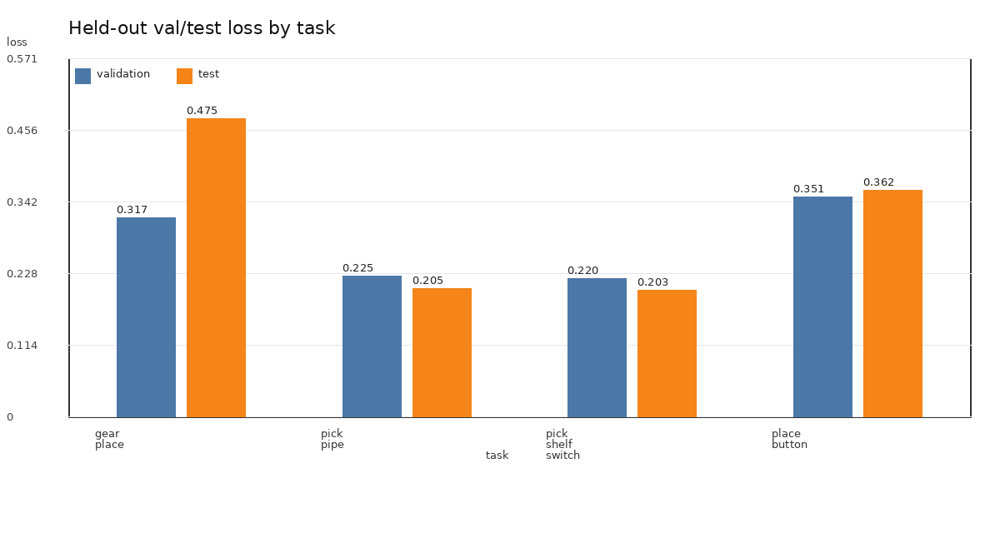
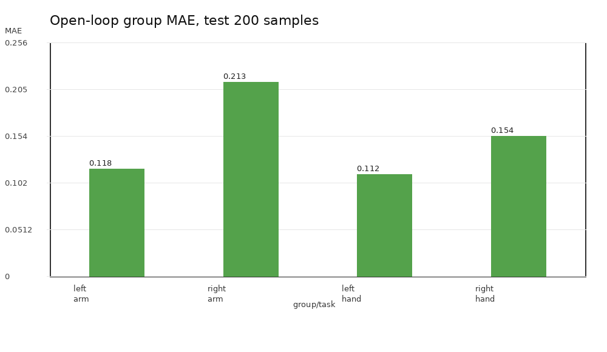
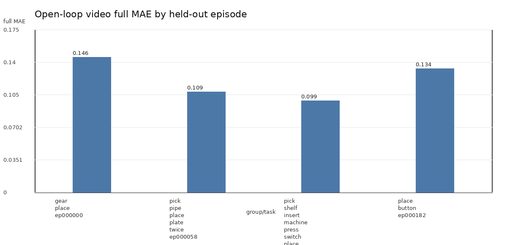

# balanced232_050000 训练与评估报告

> 本报告整理 SmolVLA LoRA `balanced232_050000` 的训练日志、held-out val/test loss、open-loop action 指标和视频产物。
> 所有指标都是 offline imitation / open-loop sanity check，不代表 XVLA Isaac Sim 闭环成功率。

## 1. 运行配置

| 项目 | 值 |
| --- | --- |
| dataset | `local/robomind_xsens_xvla_multitask_v4_balanced_232` |
| episodes / frames | `232 / 129,186` |
| train / val / test episodes | `184 / 24 / 24` |
| per-task train / val / test | `46 / 6 / 6` |
| base policy | `lerobot/smolvla_base` |
| LoRA rank | `16` |
| steps | `50,000` |
| batch size / num_workers | `2 / 2` |
| final checkpoint | `/home/slzheng/datasets/xvla/runs/smolvla_lora_xvla_multitask_v4_balanced232_50000_bs2_nw2/checkpoints/050000/pretrained_model` |

## 2. 训练过程

| 指标 | 值 |
| --- | ---: |
| 解析到的 log 点数 | 500 |
| 首个记录 step / loss | 100 / 4.1760 |
| 最后记录 step / loss | 49999 / 0.2190 |
| loss 相对变化 | -94.8% |
| 最后 20 个 log 点平均 loss | 0.2273 |
| 最后 20 个 log 点平均 grad norm | 1.4732 |
| 最后 20 个 log 点平均 data_s / update_s | 0.3434 / 0.0730 |
| log 时间跨度 | `5:46:03` |

### Checkpoint 附近训练 loss

| checkpoint step | logged step | loss | grad norm | lr | data_s |
| ---: | ---: | ---: | ---: | ---: | ---: |
| 5000 | 5000 | 0.4270 | 1.6790 | 9.40e-05 | 0.3300 |
| 10000 | 10000 | 0.3020 | 1.5040 | 7.60e-05 | 0.3410 |
| 15000 | 15000 | 0.2630 | 1.4620 | 5.20e-05 | 0.3500 |
| 20000 | 20000 | 0.2380 | 1.5060 | 2.70e-05 | 0.3580 |
| 25000 | 24999 | 0.2130 | 1.3640 | 9.20e-06 | 0.3450 |
| 30000 | 30000 | 0.2220 | 1.4320 | 2.50e-06 | 0.3420 |
| 35000 | 35000 | 0.2360 | 1.5190 | 2.50e-06 | 0.3470 |
| 40000 | 40000 | 0.2510 | 1.5670 | 2.50e-06 | 0.3450 |
| 45000 | 45000 | 0.2440 | 1.5720 | 2.50e-06 | 0.3410 |
| 50000 | 49999 | 0.2190 | 1.4540 | 2.50e-06 | 0.3460 |

## 3. Held-out Val/Test Flow-Matching Loss

| scope | val loss | val samples | test loss | test samples |
| --- | ---: | ---: | ---: | ---: |
| global | 0.2771 | 14124 | 0.2863 | 12607 |
| `gear_place` | 0.3174 | 5018 | 0.4755 | 2563 |
| `pick_pipe_place_plate_twice` | 0.2253 | 1925 | 0.2053 | 2316 |
| `pick_shelf_insert_machine_press_switch_place_plate` | 0.2204 | 4854 | 0.2030 | 5549 |
| `place_button` | 0.3511 | 2327 | 0.3621 | 2179 |

观察：

- `val` 和 `test` global loss 接近，当前没有明显只记住 validation split 的信号。
- `pick_pipe_place_plate_twice` 和 `pick_shelf_insert_machine_press_switch_place_plate` 的 held-out loss 较低。
- `gear_place` 的 test loss 最高，应优先结合视频检查相机视角、动作幅度和任务内部多样性。
- `place_button` 的 val/test 都偏高，后续可以增加该类数据或单独看右臂/手部误差。

## 4. Open-Loop Action 指标

### 200-sample test inspection

| group | MAE | MSE |
| --- | ---: | ---: |
| full | 0.1506 | 0.0438 |
| `left_arm` | 0.1180 | 0.0266 |
| `right_arm` | 0.2133 | 0.0869 |
| `left_hand` | 0.1119 | 0.0196 |
| `right_hand` | 0.1541 | 0.0376 |

右臂 `right_arm` MAE 最高，是当前 open-loop action error 的主要来源。

### Held-out video summaries

| episode | video | frames | full MAE | left arm | right arm | left hand | right hand |
| ---: | --- | ---: | ---: | ---: | ---: | ---: | ---: |
| 0 | `gear_place_ep000000.mp4` | 80 | 0.1462 | 0.1204 | 0.2041 | 0.1196 | 0.1354 |
| 58 | `pick_pipe_place_plate_twice_ep000058.mp4` | 80 | 0.1085 | 0.0678 | 0.1858 | 0.0550 | 0.1194 |
| 117 | `pick_shelf_insert_machine_press_switch_place_plate_ep000117.mp4` | 80 | 0.0992 | 0.0472 | 0.1864 | 0.0386 | 0.1187 |
| 182 | `place_button_ep000182.mp4` | 80 | 0.1335 | 0.0860 | 0.1970 | 0.0721 | 0.1764 |

## 5. 文件索引

| 类型 | 路径 |
| --- | --- |
| training log | `/home/slzheng/datasets/xvla/runs/logs/smolvla_lora_xvla_multitask_v4_balanced232_50000_bs2_nw2.log` |
| validation loss JSON | `/home/slzheng/datasets/xvla/eval_reports/balanced232_050000/val_per_task_loss.json` |
| test loss JSON | `/home/slzheng/datasets/xvla/eval_reports/balanced232_050000/test_per_task_loss.json` |
| open-loop inspection summary | `/home/slzheng/datasets/xvla/open_loop_inspections/balanced232_050000_test_200/summary.json` |
| open-loop video dir | `/home/slzheng/datasets/xvla/open_loop_videos/balanced232_050000` |
| generated CSV | `data/training_metrics.csv` |
| checkpoint CSV | `data/checkpoint_train_loss.csv` |
| eval CSV | `data/eval_loss_summary.csv` |

## 6. 结论

当前 50k baseline 已经明显学到 offline imitation 分布，训练 loss 从 4.176 降到 0.219，held-out global loss 在 `0.28` 左右。
下一步若继续提高比赛相关性，应优先处理两件事：一是查看 `gear_place` / `place_button` 视频定位误差来源；二是等待或实现 ZMQ/Isaac Sim 闭环后，用真实 benchmark success rate 评估。
